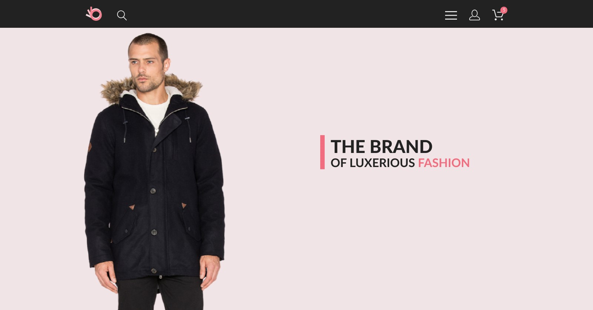

# THE BRAND of luxerious fashion

## Верстка по макету.

Для вертски сайта использовался [этот макет](https://www.figma.com/file/mnLY69cYE5cqWM5w6n5hXx/Seo-%26-Digital-Marketing-Landing-Page?node-id=190%3A1624&mode=dev). Pages - HomeWork9.

### Целью верстки данного сайта было закрепление следующхи заний:
- Структура HTML документа
- Основные теги и их атрибуты
- Виды ссылок
- Формы и их элементы
- Спецсимволы и типограф
- Типы и преимущества изображений
- Основы CSS и способы оформления
- Способы объявления CSS, плюсы и минусты каждого из видов
- Виды селекторов
- Единицы измерения
- Работа с макетоми и их виды
- Свойство display, строчные и блочные элементы
- Основы Flexbox и Grid layout
- Свойства position
- Основы создания адаптивного сайта
- Медиазапросы
- Новые семантические элементы HTML5 
- Псевдоклассы и псевдоэлементы
- Новые возможности CSS3: амимация, трансформация, плавный переход
- Основы работы с Bootstrap
- Основные инструменты разработчика: отладчик браузера, валидатор, оптимизатор изображений, типограф